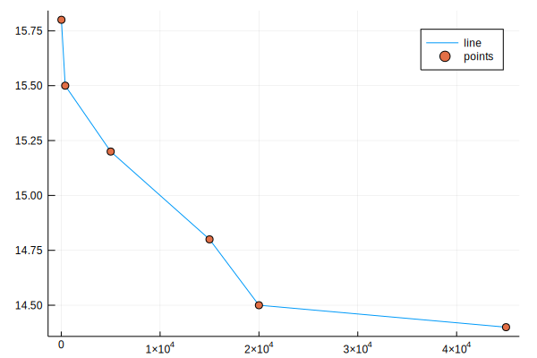
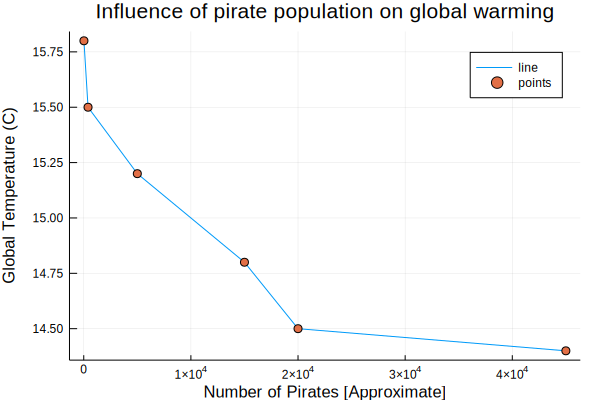
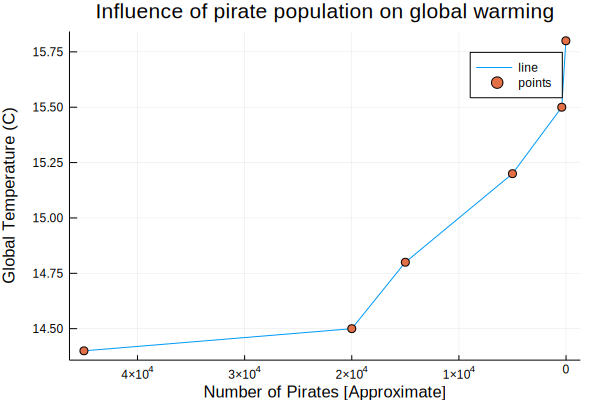

# Intro to plotting in Julia

There are a few different ways to plot in Julia (including calling PyPlot). <br>

Here we'll show you how to use `Plots.jl`.


<div class="input_area">
	
```julia
using Pkg; Pkg.add("Plots")
using Plots
```

</div>

      Updating registry at `~/.julia/registries/General`
      Updating git-repo `https://github.com/JuliaRegistries/General.git`
    [?25l[?25h Resolving package versions...
      Updating `~/.julia/environments/v1.0/Project.toml`
     [no changes]
      Updating `~/.julia/environments/v1.0/Manifest.toml`
     [no changes]


One of the advantages to `Plots.jl` is that it allows you to seamlessly change backends. In this notebook, we'll try out the `gr()` and `plotlyjs()` backends.<br>

In the name of scientific inquiry, let's use this notebook to examine the relationship between the global temperature and the number of pirates between roughly 1860 and 2000.


<div class="input_area">
	
```julia
globaltemperatures = [14.4, 14.5, 14.8, 15.2, 15.5, 15.8]
numpirates = [45000, 20000, 15000, 5000, 400, 17]
```

</div>


    6-element Array{Int64,1}:
     45000
     20000
     15000
      5000
       400
        17


**To get plotting, let's load the GR backend**


<div class="input_area">
	
```julia
gr()
```

</div>


    Plots.GRBackend()


and now we can use commands like `plot` and `scatter` to generate plots.


<div class="input_area">
	
```julia
plot(numpirates, globaltemperatures, label="line")  
scatter!(numpirates, globaltemperatures, label="points") 
```

</div>





The `!` at the end of the `scatter!` function name makes `scatter!` a mutating function, indicating that the scattered points will be added onto the pre-existing plot.

In contrast, see what happens when you replace `scatter!` in the above with the non-mutating function `scatter`.

Next, let's update this plot with the `xlabel!`, `ylabel!`, and `title!` commands to add more information to our plot.


<div class="input_area">
	
```julia
xlabel!("Number of Pirates [Approximate]")
ylabel!("Global Temperature (C)")
title!("Influence of pirate population on global warming")
```

</div>





This still doesn't look quite right. The number of pirates has decreased since 1860, so reading the plot from left to right is like looking backwards in time rather than forwards. Let's flip the x axis to better see how pirate populations have caused global temperatures to change over time!


<div class="input_area">
	
```julia
xflip!()
```

</div>





And there we have it!

Note: We've had some confusion about this exercise. :) This is a joke about how people often conflate correlation and causation.

**Without changing syntax, we can create this plot with the `unicodeplots()` backend**


<div class="input_area">
	
```julia
using Pkg; Pkg.add("UnicodePlots")
unicodeplots()
```

</div>

     Resolving package versions...
      Updating `~/.julia/environments/v1.0/Project.toml`
      [b8865327] + UnicodePlots v0.3.1
      Updating `~/.julia/environments/v1.0/Manifest.toml`
      [b8865327] + UnicodePlots v0.3.1


    ┌ Info: Recompiling stale cache file /home/raphaelb/.julia/compiled/v1.0/UnicodePlots/Ctj9q.ji for UnicodePlots [b8865327-cd53-5732-bb35-84acbb429228]
    └ @ Base loading.jl:1187


    Plots.UnicodePlotsBackend()


<div class="input_area">
	
```julia
plot(numpirates, globaltemperatures, label="line")  
scatter!(numpirates, globaltemperatures, label="points") 
xlabel!("Number of Pirates [Approximate]")
ylabel!("Global Temperature (C)")
title!("Influence of pirate population on global warming")
```

</div>


                                       Influence of pirate population on global warming
                                 +------------------------------------------------------------+       
                              16 |          ,                                                 | line  
                                 |          |                                                 | points
                                 |          |                                                 |       
                                 |          |                                                 |       
                                 |          |                                                 |       
                                 |          F.                                                |       
                                 |          | \.                                              |       
                                 |          |  ".                                             |       
                                 |          |    "..                                          |       
       Global Temperature (C)    |          |      "`.                                        |       
                                 |          |         "-.                                     |       
                                 |          |           "\..                                  |       
                                 |          |              \.                                 |       
                                 |          |                `.                               |       
                                 |          |                 ".                              |       
                                 |          |                   """"""""`-------.________.    |       
                                 |          |                                                 |       
                                 |          |                                                 |       
                                 |          |                                                 |       
                              14 |          |                                                 |       
                                 +------------------------------------------------------------+       
                                 -10000                                                   50000
                                                Number of Pirates [Approximate]


And notice how this second plot differs from the first!
