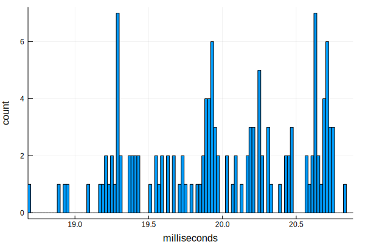

# Julia is fast

Very often, benchmarks are used to compare languages.  These benchmarks can lead to long discussions, first as to exactly what is being benchmarked and secondly what explains the differences.  These simple questions can sometimes get more complicated than you at first might imagine.

The purpose of this notebook is for you to see a simple benchmark for yourself.  One can read the notebook and see what happened on the author's Macbook Pro with a 4-core Intel Core I7, or run the notebook yourself.

(This material began life as a wonderful lecture by Steven Johnson at MIT: https://github.com/stevengj/18S096/blob/master/lectures/lecture1/Boxes-and-registers.ipynb.)

# Outline of this notebook

- Define the sum function
- Implementations & benchmarking of sum in...
    - C (hand-written)
    - C (hand-written with -ffast-math)
    - python (built-in)
    - python (numpy)
    - python (hand-written)
    - Julia (built-in)
    - Julia (hand-written)
    - Julia (hand-written with SIMD)
- Summary of benchmarks

# `sum`: An easy enough function to understand

Consider the  **sum** function `sum(a)`, which computes
$$
\mathrm{sum}(a) = \sum_{i=1}^n a_i,
$$
where $n$ is the length of `a`.


<div class="input_area">
	
```julia
a = rand(10^7) # 1D vector of random numbers, uniform on [0,1)
```

</div>


    10000000-element Array{Float64,1}:
     0.7555525224966515 
     0.7226421600954749 
     0.3686849691568155 
     0.4391369644148555 
     0.18818238616851368
     0.6875689453735636 
     0.5929445351462672 
     0.40636884349970015
     0.11416186640347914
     0.5346301360597583 
     0.1864661845374891 
     0.3635838460941345 
     0.8631905131374886 
     ⋮                  
     0.7347662122931133 
     0.13757142567721248
     0.722313542026447  
     0.2841786989917985 
     0.5976575850068786 
     0.48371925795619375
     0.612698622330109  
     0.5633557714839461 
     0.9525501059092432 
     0.5132878594971972 
     0.8089524941132771 
     0.4567671326816063 


<div class="input_area">
	
```julia
sum(a)
```

</div>


    4.999681685390142e6


The expected result is 0.5 * 10^7, since the mean of each entry is 0.5

# Benchmarking a few ways in a few languages


<div class="input_area">
	
```julia
@time sum(a)
```

</div>

      0.005489 seconds (5 allocations: 176 bytes)


    4.999681685390142e6


<div class="input_area">
	
```julia
@time sum(a)
```

</div>

      0.009588 seconds (5 allocations: 176 bytes)


    4.999681685390142e6


<div class="input_area">
	
```julia
@time sum(a)
```

</div>

      0.009077 seconds (5 allocations: 176 bytes)


    4.999681685390142e6


The `@time` macro can yield noisy results, so it's not our best choice for benchmarking!

Luckily, Julia has a `BenchmarkTools.jl` package to make benchmarking easy and accurate:


<div class="input_area">
	
```julia
# using Pkg
# Pkg.add("BenchmarkTools")
```

</div>


<div class="input_area">
	
```julia
using BenchmarkTools  
```

</div>

#  1. The C language

C is often considered the gold standard: difficult on the human, nice for the machine. Getting within a factor of 2 of C is often satisfying. Nonetheless, even within C, there are many kinds of optimizations possible that a naive C writer may or may not get the advantage of.

The current author does not speak C, so he does not read the cell below, but is happy to know that you can put C code in a Julia session, compile it, and run it. Note that the `"""` wrap a multi-line string.


<div class="input_area">
	
```julia
using Libdl
C_code = """
#include <stddef.h>
double c_sum(size_t n, double *X) {
    double s = 0.0;
    for (size_t i = 0; i < n; ++i) {
        s += X[i];
    }
    return s;
}
"""

const Clib = tempname()   # make a temporary file


# compile to a shared library by piping C_code to gcc
# (works only if you have gcc installed):

open(`gcc -fPIC -O3 -msse3 -xc -shared -o $(Clib * "." * Libdl.dlext) -`, "w") do f
    print(f, C_code) 
end

# define a Julia function that calls the C function:
c_sum(X::Array{Float64}) = ccall(("c_sum", Clib), Float64, (Csize_t, Ptr{Float64}), length(X), X)
```

</div>


    c_sum (generic function with 1 method)


<div class="input_area">
	
```julia
c_sum(a)
```

</div>


    4.999681685389632e6


<div class="input_area">
	
```julia
c_sum(a) ≈ sum(a) # type \approx and then <TAB> to get the ≈ symbolb
```

</div>


    true


<div class="input_area">
	
```julia
c_sum(a) - sum(a)  
```

</div>


    -5.094334483146667e-7


<div class="input_area">
	
```julia
≈  # alias for the `isapprox` function
```

</div>


    isapprox (generic function with 8 methods)


<div class="input_area">
	
```julia
?isapprox
```

</div>

    search: isapprox
    


```
isapprox(x, y; rtol::Real=atol>0 ? 0 : √eps, atol::Real=0, nans::Bool=false, norm::Function)
```

Inexact equality comparison: `true` if `norm(x-y) <= max(atol, rtol*max(norm(x), norm(y)))`. The default `atol` is zero and the default `rtol` depends on the types of `x` and `y`. The keyword argument `nans` determines whether or not NaN values are considered equal (defaults to false).

For real or complex floating-point values, if an `atol > 0` is not specified, `rtol` defaults to the square root of [`eps`](@ref) of the type of `x` or `y`, whichever is bigger (least precise). This corresponds to requiring equality of about half of the significand digits. Otherwise, e.g. for integer arguments or if an `atol > 0` is supplied, `rtol` defaults to zero.

`x` and `y` may also be arrays of numbers, in which case `norm` defaults to `vecnorm` but may be changed by passing a `norm::Function` keyword argument. (For numbers, `norm` is the same thing as `abs`.) When `x` and `y` are arrays, if `norm(x-y)` is not finite (i.e. `±Inf` or `NaN`), the comparison falls back to checking whether all elements of `x` and `y` are approximately equal component-wise.

The binary operator `≈` is equivalent to `isapprox` with the default arguments, and `x ≉ y` is equivalent to `!isapprox(x,y)`.

Note that `x ≈ 0` (i.e., comparing to zero with the default tolerances) is equivalent to `x == 0` since the default `atol` is `0`.  In such cases, you should either supply an appropriate `atol` (or use `norm(x) ≤ atol`) or rearrange your code (e.g. use `x ≈ y` rather than `x - y ≈ 0`).   It is not possible to pick a nonzero `atol` automatically because it depends on the overall scaling (the "units") of your problem: for example, in `x - y ≈ 0`, `atol=1e-9` is an absurdly small tolerance if `x` is the [radius of the Earth](https://en.wikipedia.org/wiki/Earth_radius) in meters, but an absurdly large tolerance if `x` is the [radius of a Hydrogen atom](https://en.wikipedia.org/wiki/Bohr_radius) in meters.

# Examples

```jldoctest
julia> 0.1 ≈ (0.1 - 1e-10)
true

julia> isapprox(10, 11; atol = 2)
true

julia> isapprox([10.0^9, 1.0], [10.0^9, 2.0])
true

julia> 1e-10 ≈ 0
false

julia> isapprox(1e-10, 0, atol=1e-8)
true
```


We can now benchmark the C code directly from Julia:


<div class="input_area">
	
```julia
c_bench = @benchmark c_sum($a)
```

</div>


    BenchmarkTools.Trial: 
      memory estimate:  0 bytes
      allocs estimate:  0
      --------------
      minimum time:     18.692 ms (0.00% GC)
      median time:      20.694 ms (0.00% GC)
      mean time:        21.461 ms (0.00% GC)
      maximum time:     29.078 ms (0.00% GC)
      --------------
      samples:          233
      evals/sample:     1


<div class="input_area">
	
```julia
println("C: Fastest time was $(minimum(c_bench.times) / 1e6) msec")
```

</div>

    C: Fastest time was 18.691859 msec


<div class="input_area">
	
```julia
d = Dict()  # a "dictionary", i.e. an associative array
d["C"] = minimum(c_bench.times) / 1e6  # in milliseconds
d
```

</div>


    Dict{Any,Any} with 1 entry:
      "C" => 18.6919


<div class="input_area">
	
```julia
using Plots
gr()
```

</div>


    Plots.GRBackend()


<div class="input_area">
	
```julia
using Statistics # bring in statistical support for standard deviations
t = c_bench.times / 1e6 # times in milliseconds
m, σ = minimum(t), std(t)

histogram(t, bins=500,
    xlim=(m - 0.01, m + σ),
    xlabel="milliseconds", ylabel="count", label="")
```

</div>





# 2. C with -ffast-math

If we allow C to re-arrange the floating point operations, then it'll vectorize with SIMD (single instruction, multiple data) instructions.


<div class="input_area">
	
```julia
const Clib_fastmath = tempname()   # make a temporary file

# The same as above but with a -ffast-math flag added
open(`gcc -fPIC -O3 -msse3 -xc -shared -ffast-math -o $(Clib_fastmath * "." * Libdl.dlext) -`, "w") do f
    print(f, C_code) 
end

# define a Julia function that calls the C function:
c_sum_fastmath(X::Array{Float64}) = ccall(("c_sum", Clib_fastmath), Float64, (Csize_t, Ptr{Float64}), length(X), X)
```

</div>


    c_sum_fastmath (generic function with 1 method)


<div class="input_area">
	
```julia
c_fastmath_bench = @benchmark $c_sum_fastmath($a)
```

</div>


    BenchmarkTools.Trial: 
      memory estimate:  0 bytes
      allocs estimate:  0
      --------------
      minimum time:     8.572 ms (0.00% GC)
      median time:      9.785 ms (0.00% GC)
      mean time:        10.210 ms (0.00% GC)
      maximum time:     14.546 ms (0.00% GC)
      --------------
      samples:          489
      evals/sample:     1


<div class="input_area">
	
```julia
d["C -ffast-math"] = minimum(c_fastmath_bench.times) / 1e6  # in milliseconds
```

</div>


    8.571663


# 3. Python's built in `sum` 

The `PyCall` package provides a Julia interface to Python:


<div class="input_area">
	
```julia
# using Pkg; Pkg.add("PyCall")
using PyCall
```

</div>


<div class="input_area">
	
```julia
# get the Python built-in "sum" function:
pysum = pybuiltin("sum")
```

</div>


    PyObject <built-in function sum>


<div class="input_area">
	
```julia
pysum(a)
```

</div>


    4.999681685389632e6


<div class="input_area">
	
```julia
pysum(a) ≈ sum(a)
```

</div>


    true


<div class="input_area">
	
```julia
py_list_bench = @benchmark $pysum($a)
```

</div>


    BenchmarkTools.Trial: 
      memory estimate:  152.60 MiB
      allocs estimate:  10000054
      --------------
      minimum time:     1.393 s (34.20% GC)
      median time:      1.875 s (35.76% GC)
      mean time:        1.898 s (34.96% GC)
      maximum time:     2.424 s (34.77% GC)
      --------------
      samples:          3
      evals/sample:     1


<div class="input_area">
	
```julia
d["Python built-in"] = minimum(py_list_bench.times) / 1e6
d
```

</div>


    Dict{Any,Any} with 3 entries:
      "C"               => 18.6919
      "Python built-in" => 1392.92
      "C -ffast-math"   => 8.57166


# 4. Python: `numpy` 

## Takes advantage of hardware "SIMD", but only works when it works.

`numpy` is an optimized C library, callable from Python.
It may be installed within Julia as follows:


<div class="input_area">
	
```julia
using Pkg; Pkg.add("Conda")
using Conda
```

</div>

      Updating registry at `~/.julia/registries/General`
      Updating git-repo `https://github.com/JuliaRegistries/General.git`
    [?25l[?25h Resolving package versions...
      Updating `~/.julia/environments/v1.0/Project.toml`
     [no changes]
      Updating `~/.julia/environments/v1.0/Manifest.toml`
     [no changes]


<div class="input_area">
	
```julia
Conda.add("numpy")
```

</div>

    ┌ Info: Running `conda install -y numpy` in root environment
    └ @ Conda /home/raphaelb/.julia/packages/Conda/uQitS/src/Conda.jl:112


    Solving environment: ...working... done
    
    # All requested packages already installed.
    


<div class="input_area">
	
```julia
numpy_sum = pyimport("numpy")["sum"]

py_numpy_bench = @benchmark $numpy_sum($a)
```

</div>


    BenchmarkTools.Trial: 
      memory estimate:  368 bytes
      allocs estimate:  8
      --------------
      minimum time:     4.374 ms (0.00% GC)
      median time:      4.818 ms (0.00% GC)
      mean time:        4.903 ms (0.00% GC)
      maximum time:     8.200 ms (0.00% GC)
      --------------
      samples:          1018
      evals/sample:     1


<div class="input_area">
	
```julia
numpy_sum(a)
```

</div>


    4.999681685390145e6


<div class="input_area">
	
```julia
numpy_sum(a) ≈ sum(a)
```

</div>


    true


<div class="input_area">
	
```julia
d["Python numpy"] = minimum(py_numpy_bench.times) / 1e6
d
```

</div>


    Dict{Any,Any} with 8 entries:
      "Julia hand-written simd" => 6.22709
      "C"                       => 18.6919
      "Julia hand-written"      => 17.6705
      "Python numpy"            => 4.37422
      "Python hand-written"     => 1889.34
      "Python built-in"         => 1392.92
      "Julia built-in"          => 5.83222
      "C -ffast-math"           => 8.57166


# 5. Python, hand-written 


<div class="input_area">
	
```julia
py"""
def py_sum(A):
    s = 0.0
    for a in A:
        s += a
    return s
"""

sum_py = py"py_sum"
```

</div>


    PyObject <function py_sum at 0x7fc9d805f840>


<div class="input_area">
	
```julia
py_hand = @benchmark $sum_py($a)
```

</div>


    BenchmarkTools.Trial: 
      memory estimate:  368 bytes
      allocs estimate:  8
      --------------
      minimum time:     1.488 s (0.00% GC)
      median time:      1.558 s (0.00% GC)
      mean time:        1.572 s (0.00% GC)
      maximum time:     1.683 s (0.00% GC)
      --------------
      samples:          4
      evals/sample:     1


<div class="input_area">
	
```julia
sum_py(a)
```

</div>


    4.999681685389632e6


<div class="input_area">
	
```julia
sum_py(a) ≈ sum(a)
```

</div>


    true


<div class="input_area">
	
```julia
d["Python hand-written"] = minimum(py_hand.times) / 1e6
d
```

</div>


    Dict{Any,Any} with 8 entries:
      "Julia hand-written simd" => 6.22709
      "C"                       => 18.6919
      "Julia hand-written"      => 17.6705
      "Python numpy"            => 4.37422
      "Python hand-written"     => 1488.13
      "Python built-in"         => 1392.92
      "Julia built-in"          => 5.83222
      "C -ffast-math"           => 8.57166


# 6. Julia (built-in) 

## Written directly in Julia, not in C!


<div class="input_area">
	
```julia
@which sum(a)
```

</div>


sum(a::<b>AbstractArray</b>) in Base at <a href="https://github.com/JuliaLang/julia/tree/0d713926f85dfa3e4e0962215b909b8e47e94f48/base/reducedim.jl#L645" target="_blank">reducedim.jl:645</a>


<div class="input_area">
	
```julia
j_bench = @benchmark sum($a)
```

</div>


    BenchmarkTools.Trial: 
      memory estimate:  0 bytes
      allocs estimate:  0
      --------------
      minimum time:     5.955 ms (0.00% GC)
      median time:      7.652 ms (0.00% GC)
      mean time:        7.910 ms (0.00% GC)
      maximum time:     12.904 ms (0.00% GC)
      --------------
      samples:          631
      evals/sample:     1


<div class="input_area">
	
```julia
d["Julia built-in"] = minimum(j_bench.times) / 1e6
d
```

</div>


    Dict{Any,Any} with 8 entries:
      "Julia hand-written simd" => 6.22709
      "C"                       => 18.6919
      "Julia hand-written"      => 17.6705
      "Python numpy"            => 4.37422
      "Python hand-written"     => 1488.13
      "Python built-in"         => 1392.92
      "Julia built-in"          => 5.95542
      "C -ffast-math"           => 8.57166


# 7. Julia (hand-written) 


<div class="input_area">
	
```julia
function mysum(A)   
    s = 0.0 # s = zero(eltype(a))
    for a in A
        s += a
    end
    s
end
```

</div>


    mysum (generic function with 1 method)


<div class="input_area">
	
```julia
j_bench_hand = @benchmark mysum($a)
```

</div>


    BenchmarkTools.Trial: 
      memory estimate:  0 bytes
      allocs estimate:  0
      --------------
      minimum time:     22.777 ms (0.00% GC)
      median time:      24.510 ms (0.00% GC)
      mean time:        24.246 ms (0.00% GC)
      maximum time:     26.653 ms (0.00% GC)
      --------------
      samples:          207
      evals/sample:     1


<div class="input_area">
	
```julia
d["Julia hand-written"] = minimum(j_bench_hand.times) / 1e6
d
```

</div>


    Dict{Any,Any} with 8 entries:
      "Julia hand-written simd" => 6.22709
      "C"                       => 18.6919
      "Julia hand-written"      => 22.7771
      "Python numpy"            => 4.37422
      "Python hand-written"     => 1488.13
      "Python built-in"         => 1392.92
      "Julia built-in"          => 5.95542
      "C -ffast-math"           => 8.57166


# 8. Julia (hand-written w. simd) 


<div class="input_area">
	
```julia
function mysum_simd(A)   
    s = 0.0 # s = zero(eltype(A))
    @simd for a in A
        s += a
    end
    s
end
```

</div>


    mysum_simd (generic function with 1 method)


<div class="input_area">
	
```julia
j_bench_hand_simd = @benchmark mysum_simd($a)
```

</div>


    BenchmarkTools.Trial: 
      memory estimate:  0 bytes
      allocs estimate:  0
      --------------
      minimum time:     6.432 ms (0.00% GC)
      median time:      10.402 ms (0.00% GC)
      mean time:        10.445 ms (0.00% GC)
      maximum time:     17.141 ms (0.00% GC)
      --------------
      samples:          478
      evals/sample:     1


<div class="input_area">
	
```julia
mysum_simd(a)
```

</div>


    4.999681685390122e6


<div class="input_area">
	
```julia
d["Julia hand-written simd"] = minimum(j_bench_hand_simd.times) / 1e6
d
```

</div>


    Dict{Any,Any} with 8 entries:
      "Julia hand-written simd" => 6.43202
      "C"                       => 18.6919
      "Julia hand-written"      => 22.7771
      "Python numpy"            => 4.37422
      "Python hand-written"     => 1488.13
      "Python built-in"         => 1392.92
      "Julia built-in"          => 5.95542
      "C -ffast-math"           => 8.57166


# Summary


<div class="input_area">
	
```julia
for (key, value) in sort(collect(d), by=last)
    println(rpad(key, 25, "."), lpad(round(value; digits=1), 6, "."))
end
```

</div>

    Python numpy................4.4
    Julia built-in..............6.0
    Julia hand-written simd.....6.4
    C -ffast-math...............8.6
    C..........................18.7
    Julia hand-written.........22.8
    Python built-in..........1392.9
    Python hand-written......1488.1

